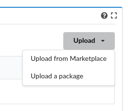
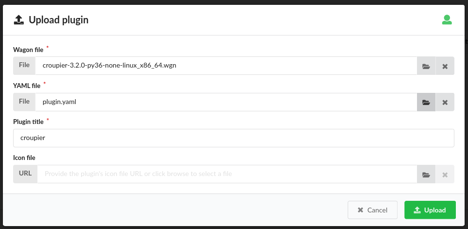
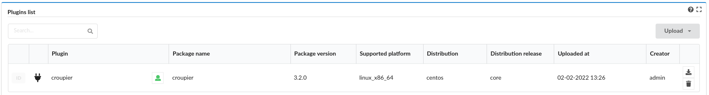

Application execution with Croupier
===================================

Introduction
------------
Croupier is a meta-orchestrator that enables end-users,
either application providers and consumers to deploy and execute applications
across multiple HPC infrastructures, and move data from one infrastructure
to another. Application providers use Croupier to make their applications
available for consumers in the Croupier marketplace. Application consumers browse
available application and execute then in selected HPC infrastructures.

Disclaimer
----------
Croupier is a HPC-metaorchestration plugin installed in
the Cloudify cloud meta-orchestrator. Both application providers and consumers
will interface Croupier through its dedicated web frontend, which is not yet
integrated for PerMedCoE project. Therefore, this current version of the
documentation uses Cloudify frontend to install applications, deploy and execute
them. Once the Croupier frontend is integration, this documentation will be
updated, replacing the Cloudify frontend.

Prerequisites
-------------
The Croupier administrator should take care of installing all required
dependencies and the Croupier plugin. Atos will provide Croupier accessible
through its frontend at http://frontend.croupier.permedcoe.eu (not yet available, stay tune!)

Cloudify installation
~~~~~~~~~~~~~~~~~~~~~
Croupier is a plugin of Cloudify cloud orchestrator (https://cloudify.co/).
To install Cloudify Community Edition, follow instructions available at: https://docs.cloudify.co/latest/trial_getting_started/set_trial_manager/download_community
The following instructions have been tested in **version 6.2.0**

Croupier installation
~~~~~~~~~~~~~~~~~~~~~
To install Croupier plugin, you need a Croupier Wagon file, compiled for CentOS.
Contact Croupier administrator (jesus.gorronogoitia@atos.net) for latest
Croupier's wheel and the ``plugin.yaml`` descriptor. Next, log into Cloudify with **admin** account.
Click on the **resources** tab in the leftmost panel. Click on the **Resources**
tab in the main page. Then, click on the **upload** button in the right of the
**Plugin list** table. Select **upload a package**

Then, in the wizard, browse click on the **File** button to search in your file
system for the **Croupier Wagon file**, and similarly for the **Croupier YAML file**.
Once selected, check the Plugin title is set to ``croupier``.
Click on the **Upload** button to accept.

Check the Croupier plugin installation in the list of plugins.

Other services:
~~~~~~~~~~~~~~~
Croupier require additional services, **KeyCloak** and **Vault** to work.

- Keycloak (https://www.keycloak.org/) is an IAM service that offers a SSO across multiple application. Croupier frontend uses KeyCloak to authenticate users
- Hashicorp Vault (https://www.vaultproject.io) is a secret store. Croupier frontend uses Vault to retrieve HPC user's credentials to get access to the target HPC frontend on behalf of the user.

Contact Croupier administrator (jesus.gorronogoitia@atos.net) for
instructions to configure your KeyCloak and Vault instances to be used
by Croupier.

Application definition (Blueprint)
----------------------------------
Application providers define their applications as meta-workflows that
execute multiple tasks (in sequence or in parallel) distributed across
one or more target HPC infrastructures.
These workflows are named **blueprints** in Cloudify terminology.
They may also specify data objects, their role as tasks'
inputs and/or outputs and the transfer entities that move such data from
one source to a target.
Croupier's workflows are specified in YAML by using the **OASIS TOSCA** language (https://docs.cloudify.co/latest/developer/blueprints/).
For the following, we use the Covid19 application as an example.

The application workflow starts with a header that declares at least imports
read the Croupier workflow model. Other imports could be possible if required
by the application.

  .. code-block:: yaml

    tosca_definitions_version: cloudify_dsl_1_3
    imports:
        - http://raw.githubusercontent.com/ari-apc-lab/croupier/master/resources/types/cfy_types.yaml
        - plugin:croupier

Next, application data types can be optionally declared. In the following
example, the Covid19 application input arguments are declared

  .. code-block:: yaml

    data_types:
    permedcoe.covid19.args:
        properties:
            metadata:
                type: string
                required: true
            model_prefix:
                type: string
                required: true
            outdir:
                type: string
                required: true
            ko_file:
                type: string
                required: true
            reps:
                type: integer
                required: true
            model:
                type: string
                required: true
            data_folder:
                type: string
                required: true

Then, the application inputs should be declared.
There is a number of common inputs for a common application:

- VAULT arguments required to obtain HPC access credentials, namely ``vault_token`` and ``user``.
- HPC properties, such as the frontend ``hpc_host`` and the ``hpc_scheduler``
- PYCOMPSs arguments, such as the ``num_nodes`` and the ``exec_time``
- Application specific args. In below example, the Covid19 input arguments

The number and type of arguments are variable and they are decided by the
application provider. For instance, several Vault services can be defined,
sharing the same vault_user, but requiring different tokens. Similarly,
several HPC infrastructures can be used to distribute workflow tasks,
and requiring dedicated inputs for each infrastructure, hence. The number
and kind of PYCOMPSs arguments can be different across applications.

**Note:** This workflow COVID19 example uses PYCOMPSs as target HPC workflow
and scheduler.

  .. code-block:: yaml

    inputs:
        ########################## VAULT ######################
        vault_token:
            type: string
        vault_user:
            type: string

        ################# HPC Infrastructures #################
        hpc_host:
            type: string

        hpc_scheduler:
            type: string

        ################# Covid 19 application ################
        covid19_args:
            type: permedcoe.covid19.args

        ##################### PYCOMPSs args ###################
        num_nodes:
            type: integer
        exec_time:
            type: integer

Next, one or more Vault nodes must be declared. Vault nodes are used
as secret stores where to retrieve from the credentials required to access
the target HPC infrastructures, through ssh, to schedule workflow' tasks
(as jobs). The following block declares one Vault node of type ``croupier.nodes.Vault``.
Note that Vault properties (``token`` and ``user``) are taken from inputs
by using the ``get_input`` function:

  .. code-block:: yaml

    node_templates:
    vault:
        type: croupier.nodes.Vault
        properties:
            token: { get_input: vault_token }
            user: { get_input: vault_user }

Then, one of more HPC infrastructures (where to execute the workflow's tasks)
are declared as node instances of the type ``croupier.nodes.InfrastructureInterface``
The mandatory properties of this type must be overridden by this node definition.
Other optional properties as well. In particular:

- ``config/infrastructure_interface`` must be given with the name of the target HPC scheduler used to launch job tasks.
- ``credentials/host`` must also be given with the host name of the HPC frontend.

In this example, HPC configuration is read from declared inputs, as the
application's consumer will be prompted to provide those values. This is a common
approach when the consumer selects a target HPC infrastructure where to execute
the application. Alternatively, a fixed target HPC infrastructure can be
specified in the workflow.

- ``job_prefix`` declare a prefix for naming the submitted jobs.
- ``base_dir`` declares the path where Croupier folder for workflow execution will be created.
- ``monitoring_options/monitor_period`` declares the period of Croupier's requests to the HPC frontend to check the task job execution/queue status.
- ``workdir_prefix`` declares the name of the folder create for every task job executed. This folder will contain the deployed application, its execution logs and

Finally, the HPC infrastructure node is associated to the Vault node, by using
a relationship of type ``retrieve_credentials_from_vault`` that states that
the HPC ``credentials`` will be retrieved from that node,
declared in the ``target``

  .. code-block:: yaml

    hpc:
        type: croupier.nodes.InfrastructureInterface
        properties:
            config:
                infrastructure_interface: { get_input: hpc_scheduler }
            credentials:
                host: { get_input: hpc_host }
            job_prefix: croupier
            base_dir: $HOME
            monitoring_options:
                monitor_period: 15
            skip_cleanup: true
            workdir_prefix: "pycompss-test"
        relationships:
            - type: retrieve_credentials_from_vault
              target: vault

Application installation
------------------------

Application instance deployment
-------------------------------

Application instance execution
------------------------------
