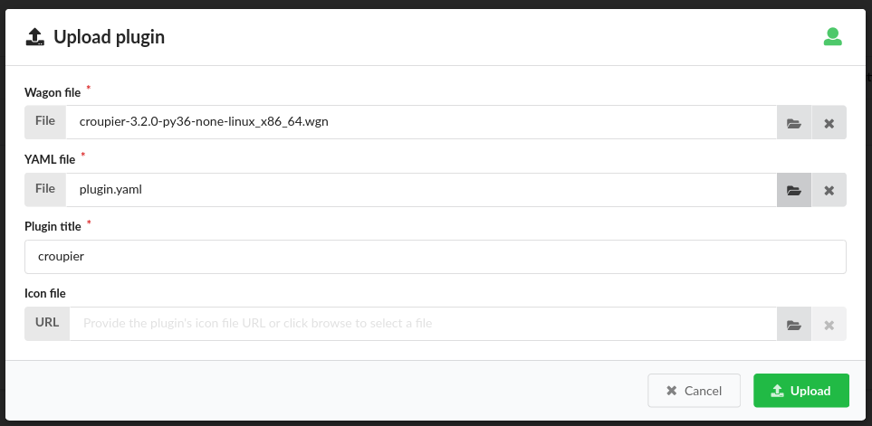

Application Execution with Croupier
===================================

Introduction
------------
Croupier is a meta-orchestrator that enables end-users,
either application providers and consumers to deploy and execute applications
across multiple HPC infrastructures, and move data from one infrastructure
to another. Application providers use Croupier to make their applications
available for consumers in the Croupier marketplace. Application consumers browse
available applications and execute then in selected HPC infrastructures.

Prerequisites
-------------
The Croupier administrator should take care of installing all required
dependencies and the Croupier plugin. Atos make Croupier ecosystem accessible
through its frontend at http://frontend.croupier.ari-aidata.eu.

Croupier's framework
--------------------
Croupier framework consist of several interconnected services, namely:

- Cloudify (https://cloudify.co/) is the Cloud workflow engine that hosts HPC-based workflow executions by using Croupier as a plugin.
- Keycloak (https://www.keycloak.org/) is an IAM service that offers a SSO across multiple application. Croupier frontend uses KeyCloak to authenticate users
- Hashicorp Vault (https://www.vaultproject.io) is a secret store. Croupier frontend uses Vault to retrieve HPC user's credentials to get access to the target HPC frontend on behalf of the user.
- Vault Secret Uploader (https://github.com/ari-apc-lab/vault-secret-uploader) offers an REST API interface for CRUD operations of Vault secrets. This API is used by users to store their credentials
- HPC Exporter (https://github.com/ari-apc-lab/hpc-exporter/tree/nojwt) collects HPC partition/queue and job execution metrics when requested by the main monitoring engine (i.e. Prometheus)
- Prometheus (https://prometheus.io/) is the main monitoring engine in the Croupier framework, storing collected metrics and offering SQL-like quering language PROMQL.
- Grafana (https://grafana.com/) is the main metrics visualization tool used to render HPC partition/queue and job dashboards
- Grafana Registry (https://github.com/ari-apc-lab/grafana-registry) tool is used to register Grafana dashboards for users executing workflows
- Croupier backend (https://github.com/ari-apc-lab/croupier-backend/tree/permedcoe) is the backend implementation of the Croupier Web-based interface. This component iteracts with Cloudify for workflow managemente and execution
- Croupier frontend (https://github.com/ari-apc-lab/croupier-frontend/tree/permedcoe) is the frontend implementation of the Croupier Web-based interface. It provides the Web UI that interfaces application consumers

Contact Croupier administrator (jesus.gorronogoitia@atos.net) for instructions to deploy and configure
instances of these services required by Croupier.

Kubernetes (k8s) manifests for the manual deployment of the Croupier services listed above are available at GitHub:
https://github.com/ari-apc-lab/k8s-resources/tree/permedcoe

Helm charts for k8s semi-automatic deployment are available at (e.g. some manual configuration is still required):
https://github.com/ari-apc-lab/k8s-resources/tree/permedcoe/helm-charts

Croupier plugin installation
~~~~~~~~~~~~~~~~~~~~~~~~~~~~
To install Croupier plugin, you need a Croupier Wagon file, compiled for CentOS.
Contact Croupier administrator (jesus.gorronogoitia@atos.net) for the latest
Croupier wheel and the ``plugin.yaml`` descriptor. Next, log into Cloudify
the with **admin** account.
Click on the **Resources** tab in the leftmost panel. Next, click on the **Plugins**
tab in the main page. Then, click on the **upload** button on the right of the
**Plugin list** table. Select **upload a package**

.. image:: ../../../_static/figures/cloudify_upload_plugin.png
   :width: 200
   :align: center

Then, in the wizard, browse click on the **File** button to search in your file
system for the **Croupier Wagon file**, and similarly for the **Croupier YAML file**.
Once selected, check the Plugin title is set to ``croupier``.
Click on the **Upload** button to accept.

Check the Croupier plugin installation in the list of plugins.

.. image:: ../../../_static/figures/cloudify_croupier_installed.png
   :width: 1000
   :align: center

Application definition (Blueprint)
----------------------------------
Application providers define their applications as meta-workflows that
execute multiple tasks (in sequence or in parallel) distributed across
one or more target HPC infrastructures.
These workflows are named **blueprints** in Cloudify terminology.
They may also specify data objects, their role as tasks'
inputs and/or outputs, the data infrastructures where those data objects are located at and
the transfer entities that move such data objects from one source to a target.
Croupier's workflows are specified in YAML by using the **OASIS TOSCA** language (https://docs.cloudify.co/latest/developer/blueprints/).
For the following, we use the Covid19 application as an example.

The application workflow starts with a header that at least declares the imports
to use the Croupier plugin. Other imports could be possible if required
by the application.

  .. code-block:: yaml

    tosca_definitions_version: cloudify_dsl_1_3
    imports:
        - http://raw.githubusercontent.com/ari-apc-lab/croupier/master/resources/types/cfy_types.yaml
        - plugin:croupier

Next, application data types can be optionally declared. In the following
example, the Covid19 application input arguments are declared

  .. code-block:: yaml

    data_types:
    permedcoe.covid19.args:
        properties:
            metadata:
                type: string
                required: true
            model_prefix:
                type: string
                required: true
            outdir:
                type: string
                required: true
            ko_file:
                type: string
                required: true
            reps:
                type: integer
                required: true
            model:
                type: string
                required: true
            data_folder:
                type: string
                required: true
            simulation_time:
                type: integer
                required: true

These data types are application specific, and determined by the application provider.

Then, the application inputs should be declared.
There is a number of common inputs for a common application,
whose examples below are taken from Covid19 app
(**Note**: some of these concrete inputs are application specific, determined by the application provider. Common ones are mentioned below):

- VAULT arguments required to obtain access credentials for target HPC and Data Service (DS), namely:
    - ``iam_jwt``: jwt token issued by Keycloak as a result of a valid user authentication
    - ``iam_user``: Keycloak user
- HPC infrastructure properties:
    - ``hpc_host``: HPC frontend endpoint
    - ``hpc_scheduler``: HPC scheduler used for task schedule. Valid supported options: SLURM, PBS, PYCOMPSS
    - ``hpc_scheduler_modules``: optional list of module commands required to enable the hpc_scheduler (Note: this may be required for PYCOMPSs)
    - ``monitor_scheduler``: HPC scheduler use for monitoring. Valid supported options: SLURM, PBS
- Data access infrastructures:
    - ``hpc_dai_host``: Data Access Infrastructure (DAI) hosting some data sources
    - ``hpc_dai_internet_access``: boolean flag specifying if DAI host supports internet access
- List of PYCOMPSs arguments, defined by type croupier.datatypes.pycompss_options.
- Application specific args:
    - ``job_pre_script``: optional list of bash script commands to executed before task submission
    - ``covid19_args``: list of Covid19 arguments

The number and type of arguments are variable and they are decided by the
application provider. For instance, several Vault services can be defined,
sharing the same vault_user, but requiring different tokens.
Several HPC infrastructures can be used to distribute workflow tasks,
requiring dedicated configuration inputs for each infrastructure, hence.
Similarly for data access infrastructures that host the data to be consumed
or produced by workflow tasks.
The number and kind of PYCOMPSs arguments can be different across applications.

**Note:** This COVID-19 workflow example uses PYCOMPSs as the workflow scheduler.

  .. code-block:: yaml

      inputs:
        ########################## VAULT ######################
        iam_jwt:
            type: string
        iam_user:
            type: string

        ################# HPC Infrastructures #################
        hpc_host:
            type: string

        hpc_scheduler:
            type: string

        hpc_scheduler_modules:
            type: list

        monitor_scheduler:
            type: string

        ################## DS Infrastructures #################
        hpc_dai_host:
            type: string

        hpc_dai_internet_access:
            type: boolean

        target_dai_host:
            type: string

        target_dai_internet_access:
            type: boolean

        ################# Covid 19 application ################
        job_pre_script:
            type: list

        covid19_args:
            type: permedcoe.covid19.args

        ##################### PYCOMPSs args ###################
        pycompss_args:
            type: croupier.datatypes.pycompss_options

Next, if the application workflow needs to collect task execution metrics for monitoring, one hpc_exporter instance,
of type of type ``croupier.nodes.HPCExporter``, must be declared

  .. code-block:: yaml

    node_templates:
        hpc_exporter:
            type: croupier.nodes.HPCExporter

Then, one or more Vault nodes must be declared. Vault nodes are used
as secret stores where to retrieve from the credentials required to access
the target HPC infrastructures, through ssh, to schedule workflow' tasks
(as jobs). The following block declares one Vault node of type ``croupier.nodes.Vault``.
Note that Vault properties (``jwt`` and ``user``) are taken from inputs
by using the ``get_input`` function:

  .. code-block:: yaml

    vault:
        type: croupier.nodes.Vault
        properties:
            jwt: { get_input: iam_jwt }
            user: { get_input: iam_user }

**WORKFLOW SPECIFICATION**

Then, one of more HPC infrastructures (where to execute the workflow's tasks)
are declared as node instances of the type ``croupier.nodes.InfrastructureInterface``
The mandatory properties of this type must be overridden by this node definition.
Other optional properties as well. In particular:

- ``config/infrastructure_interface`` must be given with the name of the target HPC scheduler used to launch job tasks.
- ``credentials/host`` must also be given with the host name of the HPC frontend.

In this example, HPC configuration is read from declared inputs, as the
application's consumer will be prompted to provide those values. This is a common
approach when the consumer selects a target HPC infrastructure where to execute
the application. Alternatively, a fixed target HPC infrastructure can be
specified in the workflow.

- ``job_prefix`` declare a prefix for naming the submitted jobs.
- ``base_dir`` declares the path where Croupier folder for workflow execution will be created.
- ``monitoring_options/monitor_period`` declares the period of Croupier's requests to the HPC frontend to check the task job execution/queue status.
- ``monitoring_options/monitor_interface`` declares the HPC scheduler used to collect partition/queue and task execution metrics. If not set, the HPC scheduler for task submission is used. It is required if task scheduler is PYCOMPSs, as it cannot be used for monitoring
- ``workdir_prefix`` declares the name of the folder create for every task job executed. This folder will contain the deployed application, its execution logs and

Finally, the HPC infrastructure node is associated to the Vault node, by using
a relationship of type ``retrieve_credentials_from_vault`` that states that
the HPC ``credentials`` will be retrieved from that node,
declared in the ``target``. Similarly, the relationship ``interface_monitored_by`` establishes the
monitoring exporter used to collect HPC partition/queues and task metrics

  .. code-block:: yaml

    hpc:
        type: croupier.nodes.InfrastructureInterface
        properties:
            config:
                infrastructure_interface: { get_input: hpc_scheduler }
                modules: { get_input: hpc_scheduler_modules}
            credentials:
                host: { get_input: hpc_host }
            job_prefix: croupier
            base_dir: $HOME
            monitoring_options:
                monitor_period: 60
                monitor_interface: { get_input: monitor_scheduler }
            skip_cleanup: true
            workdir_prefix: "covid19-deploy"
        relationships:
            - type: retrieve_credentials_from_vault
              target: vault
            - type: interface_monitored_by
              target: hpc_exporter

In a similar way, the workflow provider can define additional HPC
infrastructures in case the workflow's tasks are distributed across them.

Next, one or more tasks are defined, as node instances of type
``croupier.nodes.Job`` or its subclasses. In the following example,
a application task to be executed by **PYCOMPSs** is defined,
as an instance of type ``croupier.nodes.PyCOMPSsJob``:

  .. code-block:: yaml

    job:
        type: croupier.nodes.PyCOMPSsJob
        properties:
            job_options:
                pre_script: { get_input: job_pre_script}
                app_name: covid19
                app_source: permedcoe_apps/covid19/covid-19-workflow-main/Workflow/PyCOMPSs/src
                env:
                    - COMPSS_PYTHON_VERSION: 3
                    - PERMEDCOE_IMAGES: ${PERMEDCOE_IMAGES}
                    - dataset: $HOME/permedcoe_apps/covid19/covid-19-workflow-main/Resources/data
                compss_args: { get_input: pycompss_args }
                app_file: '$(pwd)/covid19_pilot.py'
                app_args: { get_input: covid19_args }
            deployment:
                bootstrap: "scripts/deploy.sh"
                revert: "scripts/revert.sh"
                hpc_execution: false
            skip_cleanup: True
        relationships:
            - type: task_managed_by_interface
              target: hpc
            - type: input
              target: data_small
            - type: output
              target: covid_results
            - type: deployment_source
              target: github_data_access_infra

Every task type has its own properties, including those inherited
from the base type. For tasks of type ``croupier.nodes.PyCOMPSsJob``,
like in above example, the properties required to define a task are encoded under the ``job_options`` property:

- ``pre_script``: list of commands to be executed before the application is submitted by the PYCOMPSs manager.
- ``app_name``: the name of the application
- ``app_source``: path to the application task source, from where it will be executed
- ``env``: list of environment variables
- ``compss_args``: list of PYCOMPSs arguments. See `PYCOMPSs documentation <https://pycompss.readthedocs.io/en/stable/Sections/03_Execution_Environments/01_Master_worker/01_Local/01_Executing.html#runcompss-command>`_ for more details
- ``app_file``: path to the application executable file, in the deployed folder
- ``app_args``: list of application arguments. Consult the concrete application documentation

Optionally, tasks can include a ``deployment`` property to request the deployment of the task app,
before it is scheduled in the target HPC. This property includes:

- ``bootstrap``: the path to the script that deploys the task application. This path is relative to the **blueprint zip** installed in Cloudify. This script is provided by the application workflow's provider.
- ``revert``: the path to the script that undeploys the task application
- ``hpc_execution``: boolean stating whether or not the script should be executed within the HPC frontend. If false, it will be executed from Cloudify/Croupier host. This is relevant when HPC has not Internet access and app deployment requires external resources.

Next, the task is declared to be run in a HPC infrastructure by setting a relationship of type
``task_managed_by_interface`` whose ``target`` points at a HPC node declared before.
Optionally, tasks inputs and outputs can be declared by using the ``input`` and ``output`` relationships, respectively.
They refer to **data objects** declared within the **dataflow** specification. See below subsection in **Dataflow Specification**.
In case a ``deployment`` block has been specified within the properties block, the server source for application deployment
can optionally be specified with the ``deployment_source`` relationship.
This is required when this deployment source is not hardcoded in the deployment script, so the application
can be deployed from a source to specify.

Note that in this specification of a PYCOMPSs task, some properties are
hardcoded by the application provider, while others
(e.g. ``app_source`` of ``compss_args``, or ``app_args``) are taken from the
declared workflow's inputs, by using the ``get_input`` function. The
application provider decides what data must be provided by the consumer as input.

**DATAFLOW SPECIFICATION**

Besides the specification of the  workflow, the application blueprint can include the
specification of the dataflow, which consist of the declaration of :

- **data access infrastructures** that host the data consumed/produced by the workflow
- **data objects** consumed/produced by workflow tasks as inputs/outputs
- **data transfer objects** that move data from one source to a target

Data access infrastructures are declared as node templates of type ``croupier.nodes.DataAccessInfrastructure``

  .. code-block:: yaml

    hpc_data_access_infra:
        type: croupier.nodes.DataAccessInfrastructure
        properties:
            endpoint: { get_input: hpc_dai_host }
            internet_access: { get_input: hpc_dai_internet_access }
            supported_protocols:
                - RSync
        relationships:
            - type: retrieve_credentials_from_vault
              target: vault

The mandatory ``endpoint`` property declares the data access infrastructure internet address: **http(s)://<host>:<port>**
. ``internet_access`` property declares whether or not that data infrastructure has access to Internet. Depending on this,
the **data transfer** objects can adopt different data transfer strategies. Alike the HPC infrastructure,
the ``retrieve_credentials_from_vault`` relationship can be established to use a declared **Vault** instance for
retrieving the user's credentials for accessing this infrastructure.

Data objects are declared as node instances whose types depends on the kind of data object. Currently, there are supported:

- ``croupier.nodes.FileDataSource``: data object located at the filesystem of a remote server, typically accessible by (s)ftp or rsync
- ``croupier.nodes.WebDataSource``: data object located at a Cloud Web server, accessible by HTTP

Next example, from Covid 19 app, declares a data object of ``croupier.nodes.WebDataSource`` kind.

  .. code-block:: yaml

    data_small_source:
        type: croupier.nodes.WebDataSource
        properties:
            resource: /PerMedCoE/covid-19-workflow/tree/main/Resources/data/small
        relationships:
            - type: ds_located_at
              target: github_data_access_infra

For Web data sources the property ``resource`` declares the route to the data within the infrastructure it is located,
which is declared with the ``ds_located_at`` relationship.

Next example, from Covid 19 app, declares a data object of ``croupier.nodes.FileDataSource`` kind.

.. code-block:: yaml

    data_small:
        type: croupier.nodes.FileDataSource
        properties:
            filepath: ~/permedcoe_apps/covid19/covid-19-workflow-main/Resources/data/small/
        relationships:
            - type: ds_located_at
              target: hpc_data_access_infra

For File data sources, the property ``filepath`` declares the path where the data is located within the
filesystem of the hosting infrastructure.

Data transfer objects declare objects that transfer the data located in their ``from_source`` relationship
into the data source target declared in their ``to_target`` relationship, by using the data transfer protocol
specified in the property ``transfer_protocol``

.. code-block:: yaml

    dt_http:
        type: croupier.nodes.DataTransfer
        properties:
            transfer_protocol: HTTP
        relationships:
            - type: from_source
              target: data_small_source
            - type: to_target
              target: data_small

Application installation (Rol: application provider)
----------------------------------------------------
**Frontend**: Cloudify Web UI: http://cloudify.croupier.ari-aidata.eu/

The application provider can deploy an application into Croupier, by taking
the following procedure:

- Package the folder that contains the application workflow YAML description (and possibly other artefacts required for its deployment) into a zip file, named with with the application name.
- Log into Cloudify service, go to the **Blueprints** tab in the leftmost panel, click on the **Upload** button located on the right side, select the **Upload a blueprint package** option.

- In the wizard, click on the left button with a folder icon located at the line for the **Blueprint package** field to browse your file system and locate your workflow zip file. When selected, the other wizard fields will be filled in automatically. Then, accept by clicking on **Upload** button.

- Confirm your application is listed in the list of blueprints

.. image:: ../../../_static/figures/cloudify_blueprints.png
   :width: 1000
   :align: center

This procedure is followed by any application provider to deploy her applications
into the Croupier marketplace, so that they will be available to be executed by
any consumer that gets access.

Consumers can execute selected applications (from the list of blueprints)
by following a procedure that consists of two steps:

- A consumer's instance of the application (i.e. workflow) is deployed in the target infrastructure(s) with a given set of inputs
- The application's instance is executed in the target infrastructure(s)

Application instance deployment (Rol: application consumer)
-----------------------------------------------------------
**Frontend**: Croupier Web UI: http://frontend.croupier.ari-aidata.eu/

An application consumer can browse the list of available applications in the Croupier Web UI.
For that, open the leftmost option bar (open it by clicking on the icon on the left of the Croupier
Portal header), and select Applications. Then, available applications will be
displayed in the page.

To deploy a consumer's instance of an application, the consumer takes the following
procedure:

- Click on the icon of the selected application. Then, Croupier Web will show a page showing the application details. This page includes three tabs (i.e. Basic configuration, Expert configuration and Upload file) to provide inputs for the application instance that will be created. In this example, we use an external inputs file, so select the Upload file tab

- Click on the ``Choose file`` button. Browse your file system and select your application inputs file.
- Next, you can verify the loaded inputs by selecting the ``Expert configuration`` tab. Verify the loaded inputs, complete or modify them, if needed. Provide a name to your application instance.

- Once the application inputs' values are provided, click on the **Save button** button to create the instance.

An example of ``inputs.yaml`` file for our Covid19 application is given below:

  .. code-block:: yaml

    # WORKFLOW
    # HPC infrastructures
    # HPC
    hpc_host: mn1.bsc.es
    hpc_scheduler: PYCOMPSS
    hpc_scheduler_modules:
      - export COMPSS_PYTHON_VERSION=3
      - module load COMPSs/3.0
      - module load singularity/3.5.2
      - module use /apps/modules/modulefiles/tools/COMPSs/libraries
      - module load permedcoe
    monitor_scheduler: SLURM

    # COVID19 args
    job_pre_script:
      -
    covid19_args:
      metadata: '${dataset}/metadata_clean.tsv'
      model_prefix: '${dataset}/epithelial_cell_2'
      outdir: '$(pwd)/results/'
      ko_file: '$(pwd)/ko_file.txt'
      reps: 2
      model: 'epithelial_cell_2'
      data_folder: '${dataset}'
      simulation_time: 100

    # PYCOMPSs args
    pycompss_args:
      num_nodes: 2
      exec_time: 45
      log_level: 'off'
      graph: true
      tracing: 'false'
      python_interpreter: python3
      qos: debug

    # DATAFLOW
    hpc_dai_host: dt01.bsc.es
    hpc_dai_internet_access: false

    target_dai_host: sodalite-fe.hlrs.de
    target_dai_internet_access: false

These consumer's specific inputs correspond to those declared in the Covid19 application's
workflow specification above. In particular, the consumer specifies the Mare Nostrum 4
as the HPC infrastructure where to deploy the application, as well as PyCOMPSs as
its scheduler. Then, the consumer's required inputs for the Covid19 application
are also given, together with few PyCOMPSs execution parameters, which must be
tuned according to the size of the Covid19 application inputs. Moreover, the data access infrastructures
involved in this application dataflow are also provided.

When the application deployment starts, shows the application instance page.
This page gives details about the instance, including associated inputs, in the ``Details`` tab.
The ``Logs`` tab shows the logs of last executions.
The ``Executions`` tab shows the list of executions.

Application instance execution
------------------------------
Once a consumer's instance of the application has been deployed into the target HPC
infrastructures, it can be executed.

To start a new execution, click on ``Execute`` button located at the bottom of the ``Details`` tab.

To see execution logs, click on the ``Logs`` tab. You can browse the logs
by moving through the pages, filter the logs by type, by event type, and log level.
You can refresh the logs page to fetch new ones.

To see the list of the instance executions, click on the ``Executions`` tab.
For each execution, timing, termination status, and the occurrence of errors is reported.

As a summary, the frontend dashboard (accessible from the leftmost option panel) shows all deployend instances (for any application) and the executions

