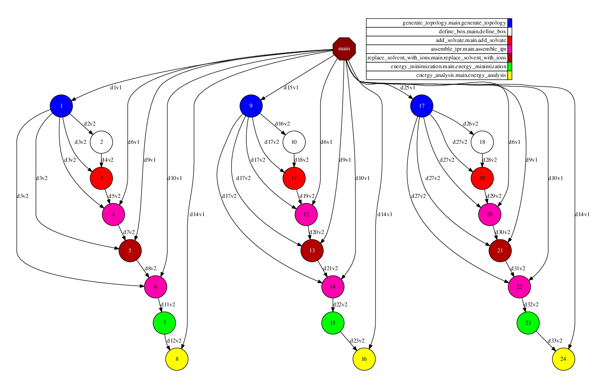

Samples
=======

Basic application
-----------------

A sample application composed by a single building block can be found in:

https://github.com/PerMedCoE/basic_application

.. TIP::

    This repository contains both the Building Block and the application.

Lysozyme in water application
-----------------------------

A complex application composed by multiple building blocks that internally call ``gromacs`` can be found in:

https://github.com/PerMedCoE/Lysozyme_in_water

.. TIP::

    This repository contains a Building Block package that implements multiple building blocks, and the application for PyCOMPSs.

