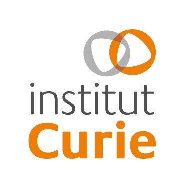

Acknowledgements
================

Partners
--------

Funding
-------

The PerMedCoE project has received funding from the European Union’s Horizon
2020 research and innovation programme under the grant agreement Nº951773

.. image:: ../../_static/Flag_of_Europe.svg
   :scale: 20
   :align: center